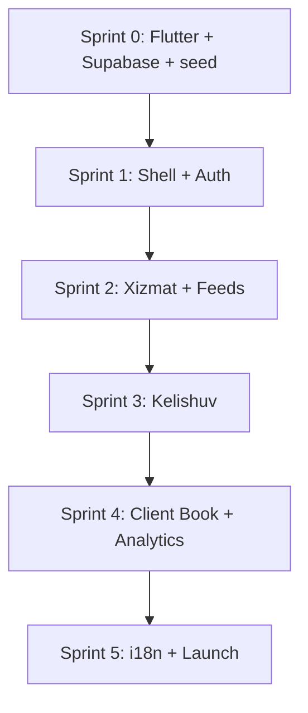

# YordamBor v1 — Implementation Plan

Step-by-step build order for the Flutter app. Product rules are locked; see [YORDAMBOR_BUILD_PLAN.md](./YORDAMBOR_BUILD_PLAN.md) for summary.

**Stack:** Flutter · Riverpod · go_router · Supabase · Hive (local Client Book)

**Estimated timeline:** 8 weeks solo · 5–6 weeks with 2 devs

---

## Milestones overview

| # | Milestone | Exit criteria |
|---|-----------|---------------|
| M0 | Project boots | App runs on simulator; Supabase connected; categories seeded |
| M1 | Shell + auth | Guest browse; register/login; 3 tabs navigate |
| M2 | Discovery | Feeds, xizmat CRUD, portfolio, favorites |
| M3 | Kelishuv | Full deal lifecycle end-to-end |
| M4 | Provider tools | Client Book, reminders, daromad, analytics |
| M5 | Launch | 4 languages, retention cron, store-ready |

---

## Sprint 0 — Foundation (Days 1–5)

### 0.1 Repository & Flutter project

```bash
cd "/Users/Erkin/Documents/My apps/YordamBor"
flutter create yordambor_app --org uz.yordambor --project-name yordambor
cd yordambor_app
```

**Dependencies to add:**

```bash
flutter pub add flutter_riverpod riverpod_annotation go_router supabase_flutter
flutter pub add freezed_annotation json_annotation hive hive_flutter
flutter pub add cached_network_image image_picker intl uuid
flutter pub add flutter_local_notifications timezone
flutter pub add --dev build_runner freezed json_serializable riverpod_generator
```

**Folder scaffold** (create empty dirs + barrel exports):

```
lib/
├── main.dart
├── app.dart
├── core/
│   ├── config/env.dart
│   ├── theme/app_theme.dart
│   ├── router/app_router.dart
│   ├── l10n/
│   └── utils/date_format.dart
├── domain/
│   ├── entities/
│   └── repositories/
├── data/
│   ├── dto/
│   ├── repositories/
│   └── local/
├── application/
│   └── providers/
└── presentation/
    ├── shell/
    ├── home/
    ├── xizmat/
    ├── kelishuv/
    ├── favorites/
    ├── profile/
    └── auth/
```

**Deliverable:** `flutter run` shows placeholder shell.

---

### 0.2 Supabase project

1. Create project at [supabase.com](https://supabase.com) (free tier).
2. Enable Email auth; configure confirm-email template.
3. Store keys in `lib/core/config/env.dart` (use `--dart-define` for prod).
4. Create Storage bucket `portfolio` (public read, auth write).

**Deliverable:** Test connection from app (login screen stub).

---

### 0.3 Database migrations (order matters)

Run as `supabase/migrations/001_initial.sql` → `002_rls.sql` → `003_seed_categories.sql`.

#### 001 — Tables

```sql
-- categories (from data/categories.json)
create table categories (
  id text primary key,
  icon text,
  name_uz text, name_ru text, name_en text, name_zh text
);

create table subcategories (
  id text not null,
  category_id text references categories(id),
  provider_type text check (provider_type in ('individual','institution')),
  name_uz text, name_ru text, name_en text, name_zh text,
  primary key (category_id, id, provider_type)
);

-- profiles (extends auth.users)
create table profiles (
  id uuid primary key references auth.users(id) on delete cascade,
  full_name text not null,
  email text unique not null,
  phone text unique not null,
  avatar_url text,
  show_phone boolean default false,
  language text default 'uz' check (language in ('uz','ru','en','zh')),
  created_at timestamptz default now()
);

create table xizmatlar (
  id uuid primary key default gen_random_uuid(),
  owner_id uuid references profiles(id) on delete cascade not null,
  name text not null,
  provider_type text not null check (provider_type in ('individual','institution')),
  category_id text references categories(id),
  subcategory_id text not null,
  description text,
  avatar_url text,
  status text default 'available' check (status in ('available','busy')),
  currency_default text default 'UZS' check (currency_default in ('UZS','USD')),
  rating_avg numeric(3,2) default 0,
  review_count int default 0,
  completed_count int default 0,
  created_at timestamptz default now(),
  constraint max_5_xizmat check (true) -- enforce via trigger
);

create table portfolio_items (
  id uuid primary key default gen_random_uuid(),
  xizmat_id uuid references xizmatlar(id) on delete cascade,
  image_url text not null,
  caption text,
  is_hero boolean default false,
  sort_order int default 0,
  created_at timestamptz default now()
);

create table yordam_kerak_posts (
  id uuid primary key default gen_random_uuid(),
  author_id uuid references profiles(id) on delete cascade,
  title text not null,
  message text,
  price numeric,
  currency text check (currency in ('UZS','USD')),
  start_date date,
  start_time time,
  duration_minutes int,
  end_date date,
  category_id text,
  subcategory_id text,
  status text default 'open' check (status in ('open','closed','deleted')),
  created_at timestamptz default now()
);

create table kelishuvlar (
  id uuid primary key default gen_random_uuid(),
  xizmat_id uuid references xizmatlar(id),
  yordam_kerak_post_id uuid references yordam_kerak_posts(id),
  party_a_id uuid references profiles(id) not null,
  party_b_id uuid references profiles(id) not null,
  initiator_id uuid references profiles(id) not null,
  status text default 'muzokarada'
    check (status in ('muzokarada','jarayonda','bajarildi','bekor','rad','archived')),
  message text,
  price numeric,
  currency text,
  start_date date,
  start_time time,
  duration_minutes int,
  end_date date,
  accept_a boolean default false,
  accept_b boolean default false,
  accept_a_at timestamptz,
  accept_b_at timestamptz,
  jarayonda_at timestamptz,
  bajarildi_at timestamptz,
  archive_at timestamptz,
  delete_at timestamptz,
  created_at timestamptz default now(),
  updated_at timestamptz default now()
);

create table kelishuv_messages (
  id uuid primary key default gen_random_uuid(),
  kelishuv_id uuid references kelishuvlar(id) on delete cascade,
  sender_id uuid references profiles(id),
  content text not null,
  created_at timestamptz default now()
);

create table reviews (
  id uuid primary key default gen_random_uuid(),
  kelishuv_id uuid references kelishuvlar(id) unique,
  xizmat_id uuid references xizmatlar(id),
  reviewer_id uuid references profiles(id),
  rating int check (rating between 1 and 5),
  comment text,
  provider_reply text,
  created_at timestamptz default now()
);

create table favorites (
  user_id uuid references profiles(id) on delete cascade,
  xizmat_id uuid references xizmatlar(id) on delete cascade,
  created_at timestamptz default now(),
  primary key (user_id, xizmat_id)
);

create table blocks (
  blocker_id uuid references profiles(id) on delete cascade,
  blocked_id uuid references profiles(id) on delete cascade,
  created_at timestamptz default now(),
  primary key (blocker_id, blocked_id)
);

create table reports (
  id uuid primary key default gen_random_uuid(),
  reporter_id uuid references profiles(id),
  target_type text,
  target_id uuid,
  reason text,
  created_at timestamptz default now()
);

create table notifications (
  id uuid primary key default gen_random_uuid(),
  user_id uuid references profiles(id) on delete cascade,
  type text not null,
  payload jsonb,
  read boolean default false,
  created_at timestamptz default now()
);

create table analytics_events (
  id uuid primary key default gen_random_uuid(),
  xizmat_id uuid references xizmatlar(id) on delete cascade,
  event_type text not null,
  user_id uuid,
  created_at timestamptz default now()
);
```

#### 002 — Triggers & RLS

- Trigger: max 5 `xizmatlar` per `owner_id`
- Trigger: one active `kelishuv` per `(xizmat_id, party pair)` while status = muzokarada
- Trigger: on dual accept → set `jarayonda_at`, status = jarayonda
- RLS policies per table (public read feeds; participant-only kelishuv)

#### 003 — Seed

- Script: read `../data/categories.json` → insert categories + subcategories
- Optional: 10 demo xizmatlar for QA

**Deliverable:** Supabase dashboard shows tables + 21 categories.

---

### 0.4 Theme & i18n scaffold

| Task | Detail |
|------|--------|
| Theme | Primary colors from `yordambor-logo.svg`; 390px-first padding |
| l10n | `flutter gen-l10n` with `app_uz.arb` (master); copy keys for ru, en, zh |
| Date utils | Port relative time: *hozir*, *N daqiqa oldin* |

**Deliverable:** Language switcher stub in Sozlamalar changes locale.

---

## Sprint 1 — App shell & auth (Days 6–12) → **M1**

### 1.1 Navigation shell

| Component | Implementation |
|-----------|----------------|
| `MainShell` | `Scaffold` + `NavigationBar` (3 tabs) |
| Top bar | `YordamBor` title + `IconButton` notifications |
| Routes | `/home`, `/favorites`, `/profile`, `/notifications`, `/auth` |

**go_router structure:**

```
/                 → redirect /home
/home             → HomeScreen (guest OK)
/favorites        → FavoritesScreen (auth gate)
/profile          → ProfileScreen
/kelishuv/:id     → KelishuvScreen (auth gate)
/xizmat/:id       → XizmatProfileScreen
/yordam-kerak/:id → PostDetailScreen
/notifications    → NotificationsScreen
/settings         → SettingsScreen
```

---

### 1.2 Auth flow

| Screen | Fields / behavior |
|--------|-------------------|
| Register | name, email, phone, password ×2, terms checkbox |
| Login | email **or** phone + password |
| Forgot password | Supabase `resetPasswordForEmail` |
| Email verify gate | Block Kelishuv/favorites/post until `emailConfirmedAt != null` |
| Auth sheet | Modal when guest taps ♥, Yordam Bor, Yordam Kerak, FAB |

**Riverpod providers:**

- `authStateProvider` — `StreamProvider` on Supabase auth
- `currentProfileProvider` — fetch `profiles` row after login
- `requireAuthProvider` — helper for gated actions

**Deliverable:** Register → verify email → see Profil with name.

---

### 1.3 Profile shell (guest + logged in)

| Section | Guest | Logged in |
|---------|-------|-----------|
| Header | Login CTA | Name, avatar |
| Mening so'rovlarim | hidden | list stub |
| Kelishuvlar | hidden | list stub |
| Xizmat ko'rsatish | hidden | CTA |
| Sozlamalar | language, privacy links | + password, delete account |

**Deliverable:** M1 — guest opens app, browses empty home, can register.

---

## Sprint 2 — Xizmat & feeds (Days 13–22) → **M2**

### 2.1 Xizmat CRUD

**Screens:**

1. `XizmatlarimListScreen` — max 5 cards
2. `XizmatEditScreen` — name, type, soha, subsoha, description, avatar, currency
3. `PortfolioManagerScreen` — add/remove photos, pick hero, caption

**Rules enforced in app + DB:**

- Cannot publish to feed without ≥1 portfolio + hero
- Subsoha list filtered by `provider_type` + `category_id`

**Storage flow:** `image_picker` → compress → upload `portfolio/{xizmat_id}/{uuid}.jpg` → save URL.

---

### 2.2 Home filters

**Widget:** `HomeFilterBar`

```
[ Yordam Bor ▾ ] [ Barchasi ] [ Soha ▾ ] [ Subsoha ▾ ] [ Mutaxassis | Tashkilot ]
```

- State: `homeFilterProvider` (Riverpod)
- Subsoha disabled until soha picked
- Switching Yordam Bor ↔ Yordam Kerak swaps feed provider

---

### 2.3 Yordam Bor feed

**Widget:** `ServiceFeedCard` (full-width, vertical scroll)

```
[ Hero portfolio image                    ♥ ]
  Service title
  Owner · Subsoha
  ⭐ rating · N ish
  [ Yordam Kerak ]
```

**Query:** xizmatlar join portfolio hero where hero exists; sort by filter → rating → created_at.

**Analytics:** fire `view` event on card visible 1s.

---

### 2.4 Yordam Kerak feed

**Widget:** `JobPostCard` + `FloatingActionButton` (E'lon qoldirish)

**Create post sheet:** title, message, price, currency, slot fields, soha/subsoha.

**Deliverable:** M2 — provider with photos appears in feed; user can ♥ and post job.

---

### 2.5 Xizmat profile & favorites

- `XizmatProfileScreen` — portfolio grid, reviews section, stats, Yordam Kerak CTA
- ♥ toggle → `favorites` table; filled state on feed cards
- `FavoritesScreen` — same card layout as feed

---

## Sprint 3 — Kelishuv engine (Days 23–35) → **M3**

### 3.1 Domain model

**Entity `Kelishuv`** with methods:

```dart
bool get canPartyAAccept;
bool get canPartyBAccept;
bool get isDualAccepted;
bool get canEdit;          // muzokarada OR jarayonda days 0-3
bool get canCancel;        // muzokarada OR jarayonda days 0-3
bool get canBajarildi;     // receiver only, day 3+ after jarayonda
void onFieldChange();      // resets accepts
```

Map `party_a` / `party_b` consistently (owner of xizmat = Yordam Bor side when initiated from post).

---

### 3.2 Kelishuv screen layout

```
┌─────────────────────────────────┐
│ [Yordam Kerak] · Topic           │
│ Narx · Sana · Vaqt · Davomiylik  │
│ ✓ Siz · ○ Ular                   │
├─────────────────────────────────┤
│ Deal timeline (messages)         │
├─────────────────────────────────┤
│ [ Edit terms ] [ Qabul qilaman ] │
└─────────────────────────────────┘
```

**Dialogs:**

- Accept → *Ishonchingiz komilmi?* + summary
- Bajarildi → *Ish bajarilganini tasdiqlaysizmi?*
- Edit in jarayonda → *Ishonchingiz komilmi?* (re-accept)

---

### 3.3 Realtime

- Subscribe `kelishuv_messages` + `kelishuvlar` for active deal
- On insert message → if other party had accepted → reset accepts + banner *Shartlar o'zgardi*

---

### 3.4 Entry points

| From | Action | Pre-filled |
|------|--------|------------|
| Xizmat card | Yordam Kerak | xizmat_id |
| Job post | Yordam Bor | post_id + pick xizmat |
| Menga kelgan | open existing | — |

**Guard:** one active muzokarada kelishuv per xizmat per user pair.

---

### 3.5 Inboxes & archive

| Profil section | Query |
|----------------|-------|
| Menga kelgan | kelishuvlar where xizmat.owner = me, grouped by xizmat |
| Mening so'rovlarim | kelishuvlar where initiator = me or author of post |
| Kelishuvlar | status in (muzokarada, jarayonda) |
| Arxiv | bajarildi, bekor, rad, archived |

**Edge function (cron daily):**

- muzokarada + 10d idle → archived, delete_at +15d
- jarayonda cancel → archive 5d, delete 10d
- bajarildi → archive 10d, delete 30d

---

### 3.6 Reviews & block/report

- After Bajarildi → `ReviewSheet` (1–5 stars + comment)
- Provider reply on xizmat profile
- Report → insert `reports`
- Block → insert `blocks`; filter feed + block new kelishuv

**Deliverable:** M3 — two test users complete full deal with review.

---

## Sprint 4 — Provider tools (Days 36–42) → **M4**

### 4.1 Local storage (Hive)

**Boxes:**

```
client_book_entries
client_book_busy_slots
reminders
earnings_rows (cache of daromad; sync optional)
```

**Never sync to Supabase.**

---

### 4.2 Client Book (Mijoz kitobi)

**Screen:** table + calendar view toggle

| Column | Field |
|--------|-------|
| Name | client_name |
| Xizmat | optional link |
| Date / time | slot |
| Phone | optional |
| Note | text |

- Auto-create row when kelishuv → jarayonda
- Busy slots block warnings on new Yordam Kerak to same xizmat

---

### 4.3 Eslatmalar

- Auto from Client Book + kelishuv slot (default offsets by subsoha category)
- Manual add/edit
- Schedule via `flutter_local_notifications`

---

### 4.4 Mening daromadim

- Auto row on dual accept (if price set)
- Editable table: xizmat, sana, holat, daromad, currency
- Not tax/legal — label *E'lon qilingan*

---

### 4.5 Analitika

Per xizmat dashboard:

| Metric | Source |
|--------|--------|
| Views | analytics_events |
| Saves | favorites count |
| Yordam Kerak in | kelishuvlar count |
| Yordam Bor out | kelishuvlar count |
| Conversion | views → kelishuv |

**Deliverable:** M4 — provider sees analytics + Client Book entry after deal.

---

## Sprint 5 — Polish & launch (Days 43–50) → **M5**

### 5.1 i18n completion

- All ARB keys × 4 languages
- Category names: load from DB (`name_uz` etc.) by user language
- QA pass per locale

### 5.2 Empty & error states

Every screen from [screen inventory](./YORDAMBOR_BUILD_PLAN.md#6-screen-inventory) gets empty UI + error retry.

### 5.3 Notifications center

- 🔔 list from `notifications` table
- Badge on Profil = count pending actions (accept, bajarildi ready)
- Tap → deep link to kelishuv / xizmat

### 5.4 Share & legal

- Share button → store URLs
- Privacy policy + terms (WebView or in-app markdown)
- Delete account → cascade kelishuv cancel + profile delete

### 5.5 Testing checklist

| Area | Test |
|------|------|
| Auth | duplicate email/phone, verify gate |
| Feed | filter combinations, empty city |
| Kelishuv | accept reset on message, 3-day bajarildi |
| One-deal rule | second request blocked |
| Block | hidden from feed |
| Client Book | survives app restart; gone on reinstall |
| Offline | browse cached feed; queue actions when online |

### 5.6 Store release

- Android: AAB, Play Console listing
- iOS: TestFlight → App Store (requires Mac + Apple account)
- App icons from `yordambor-logo.svg`

---

## Implementation order (critical path)



**Do not start Sprint 3 until Sprint 2 feeds work** — Kelishuv needs xizmat and posts.

**Client Book (Sprint 4) can parallelize** with late Sprint 3 if 2 devs.

---

## Riverpod provider map (reference)

| Provider | Responsibility |
|----------|----------------|
| `authStateProvider` | Session |
| `currentProfileProvider` | Logged-in user profile |
| `homeFilterProvider` | Feed mode + category filters |
| `yordamBorFeedProvider` | Paginated xizmat cards |
| `yordamKerakFeedProvider` | Paginated job posts |
| `xizmatDetailProvider(id)` | Single xizmat + portfolio |
| `favoritesProvider` | User favorites + ♥ state |
| `kelishuvProvider(id)` | Deal + realtime |
| `kelishuvInboxProvider(xizmatId)` | Menga kelgan |
| `notificationsProvider` | Bell + badge counts |
| `clientBookProvider` | Hive local |
| `remindersProvider` | Local notifications |
| `analyticsProvider(xizmatId)` | Aggregated stats |

---

## Risks & mitigations

| Risk | Mitigation |
|------|------------|
| Kelishuv logic bugs | Unit tests on date/accept state machine |
| Supabase costs | Free tier; optimize image sizes |
| Client Book data loss | Clear onboarding copy; export in v2 |
| Chinese translation delay | Ship with EN fallback for missing `name_zh` |
| iOS build without Mac | Use Codemagic / GitHub Actions cloud Mac |
| Empty feed at launch | Seed 20 demo providers in Tashkent |

---

## What to build first (your next session)

1. Run Sprint 0.1 — `flutter create yordambor_app`
2. Run Sprint 0.2 — Supabase project
3. Run Sprint 0.3 — migrations + seed from `data/categories.json`
4. Run Sprint 1.1 — bottom nav shell

Say **"start Sprint 0"** to begin coding.

---

*Companion docs: [YORDAMBOR_BUILD_PLAN.md](./YORDAMBOR_BUILD_PLAN.md) · [categories-taxonomy.md](./categories-taxonomy.md)*
